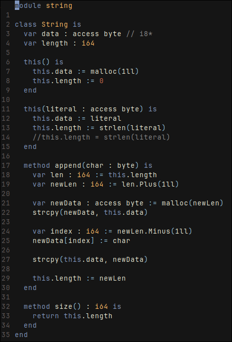

# What's this?

A simple compiler for OOP language, part of "Compiler Development: Introduction" course by E. Zouev. 

The original task was very much extended by me with a lot of additional features.

## Implementation

The original task tas to implement a compiler for a given [spec](docs/spec.txt) in C++ and LLVM. Whish is just a simple OOP language.

It was fully implemented besides generics. To get more info about impl. see final [presentation](docs/LLVMad.pdf)

## Extensions

Beyond the original task, the language supports:
- Modules (each file is a module, modules get linked together as LLVM bytecode and all symbols are exported)
- libc integration
- Pointer types (called `access`)
- `IfElif`
- main class
